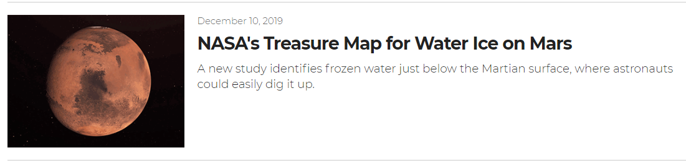
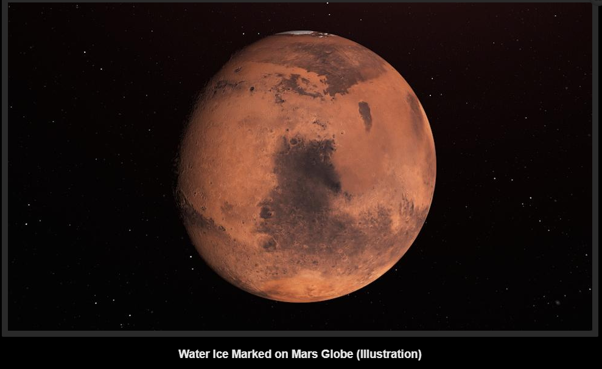
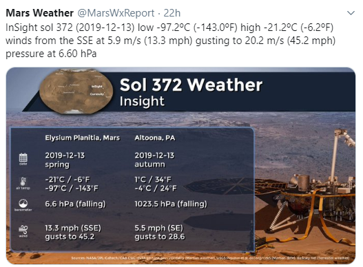
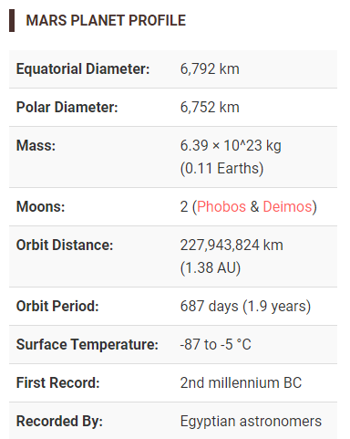
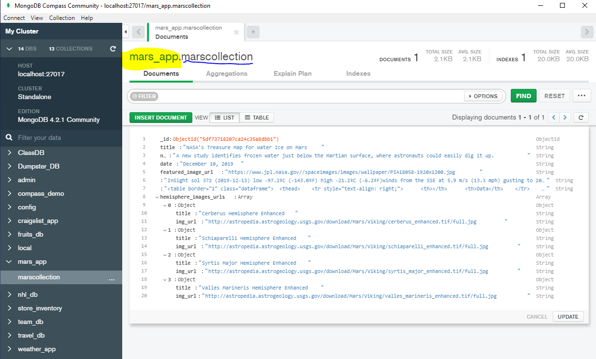
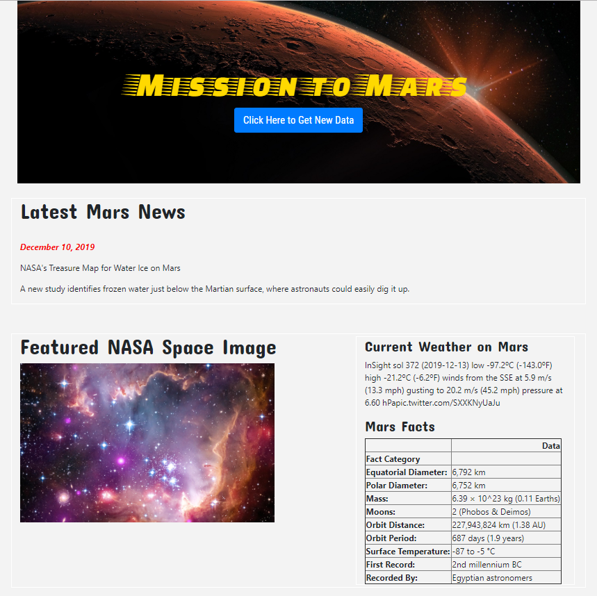
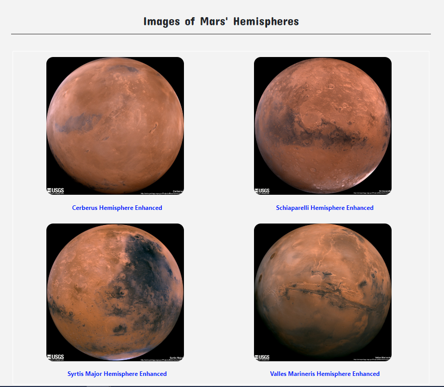

# Web Scraping Challenge - Mission to Mars

In this assignment, we will build a web application that scrapes various websites for data related to the Mission to Mars and displays the information in a single index.html page. 

# Step 1 - Scraping

Completed the "INITIAL" scraping with Jupyter Notebook, BeautifulSoup, Pandas, and Requests/Splinter.

* Created a Jupyter Notebook file called `mission_to_mars_Notebook` and used it to complete all of the test/initial scraping and analysis tasks.

* Used Splinter to navigate the sites when needed and BeautifulSoup to help find and parse out the necessary data.

## NASA Mars News


* Scraped the [NASA Mars News Site](https://mars.nasa.gov/news/) and collect the latest News Title and Paragraph Text. Assigned title & text to variables for reference later.

## JPL Mars Space Images - Featured Image


* Visited the url for JPL Featured Space Image [here](https://www.jpl.nasa.gov/spaceimages/?search=&category=Mars).
   #### ( *Carousel cycles through feature "NASA spaceimages" and therefore the featured photo "May or May Not" be a Mars Photo* )

* Used splinter to navigate the site and find the FULL SIZE image url for the current Featured Space Image and assigned the url string to a variable called `featured_image_url`.


## Mars Weather


* Visited the Mars Weather twitter account [here](https://twitter.com/marswxreport?lang=en) and scraped the latest Mars weather tweet from the page. Saved the tweet text for the weather report as a variable called `mars_weather`.

## Mars Facts


* Visited the Mars Facts webpage [here](https://space-facts.com/mars/) and used Pandas to scrape the table containing facts about the planet including Diameter, Mass, etc.

* Used Pandas to convert the data to a HTML table string. (mars_facts_table) 


## Mars Hemispheres


* Visited the USGS Astrogeology site [here](https://astrogeology.usgs.gov/search/results?q=hemisphere+enhanced&k1=target&v1=Mars) to obtain high resolution images for each of Mar's hemispheres.

* Required clicking each of the links to the hemispheres in order to acquire the image url to the full resolution image.

* Saved both the image url string for the full resolution hemisphere image, and the Hemisphere title containing the hemisphere name. Used a Python dictionary to store the data using the keys `img_url` and `title`.

* Appended the dictionary with each image url string and each hemisphere title to a list called hemisphere_image_urls. This list contains one dictionary for each hemisphere.

```My Dictionary:
hemisphere_image_urls = [
{'title': 'Cerberus Hemisphere Enhanced', 'img_url': 'http://astropedia.astrogeology.usgs.gov/download/Mars/Viking/cerberus_enhanced.tif/full.jpg'},
{'title': 'Schiaparelli Hemisphere Enhanced', 'img_url': 'http://astropedia.astrogeology.usgs.gov/download/Mars/Viking/schiaparelli_enhanced.tif/full.jpg'},
{'title': 'Syrtis Major Hemisphere Enhanced', 'img_url': 'http://astropedia.astrogeology.usgs.gov/download/Mars/Viking/syrtis_major_enhanced.tif/full.jpg'},
{'title': 'Valles Marineris Hemisphere Enhanced', 'img_url': 'http://astropedia.astrogeology.usgs.gov/download/Mars/Viking/valles_marineris_enhanced.tif/full.jpg'}
]
```

# Step 2 - MongoDB and Flask Application


Used MongoDB with Flask templating to populate my index.html page with all of the information that I scraped from the URLs above.

* Started by converting your Jupyter notebook into a Python script called `scrape_mars.py` with a function called `scrape` that executes all scraping code from above and returned one Python dictionary containing all of the scraped data.

* Next, I created a route called `/scrape` that imported my `scrape_mars.py` script and then called the `scrape` function.

* Stored the returned values in Mongo as a Python dictionary. See screenshot here:
     
  

* Created a root route `/` that queries the Mongo database and passes the mars data into my index.html template to display the scraped data.
* Used Bootstrap to structure your HTML template.
* Used both inline CSS and a seperate CSS stylesheet for styling of index.html web page. 




- - -

